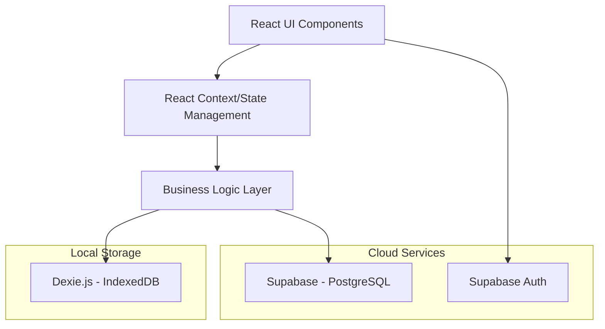
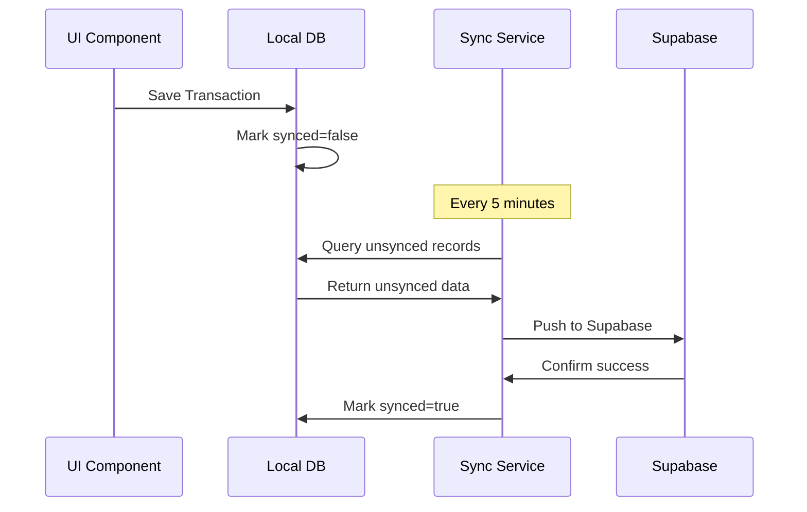

# Design Document: POS System

## Overview

The POS System is a local-first Progressive Web Application built with React and TypeScript, designed for a small retail shop in Thailand. The system prioritizes zero-latency performance through local storage while providing cloud backup capabilities. The architecture follows a layered approach with clear separation between data persistence, business logic, and user interface components.

## Architecture

### High-Level Architecture



### Technology Stack

- **Frontend**: React 19 with TypeScript
- **State Management**: React Context API
- **Local Database**: Dexie.js (IndexedDB wrapper)
- **Cloud Database**: Supabase PostgreSQL
- **Authentication**: Supabase Auth
- **Styling**: Tailwind CSS with Kanit font
- **Build Tool**: Vite with PWA plugin
- **Hosting**: Cloudflare Pages

## Components and Interfaces

### Core Components

#### 1. Authentication Layer
```typescript
interface AuthContext {
  user: User | null;
  login: (email: string, password: string) => Promise<void>;
  logout: () => Promise<void>;
  isAuthenticated: boolean;
}
```

#### 2. Cart Management
```typescript
interface CartItem {
  productId: string;
  name: string;
  sellingPrice: number;
  costPrice: number;
  quantity: number;
}

interface CartContext {
  items: CartItem[];
  addItem: (product: Product) => void;
  removeItem: (productId: string) => void;
  updateQuantity: (productId: string, quantity: number) => void;
  clearCart: () => void;
  total: number;
  saveDraft: () => Promise<void>;
  loadDraft: (draftId: string) => Promise<void>;
  drafts: Draft[];
}
```

#### 3. Product Management
```typescript
interface Product {
  id: string;
  name: string;
  description: string;
  costPrice: number;
  sellingPrice: number;
  quantity: number;
  isActive: boolean;
  createdAt: Date;
  updatedAt: Date;
}

interface ProductService {
  searchProducts: (query: string) => Product[];
  createProduct: (product: Omit<Product, 'id'>) => Promise<Product>;
  updateProduct: (id: string, updates: Partial<Product>) => Promise<Product>;
  deleteProduct: (id: string) => Promise<void>;
  getLowStockProducts: () => Product[];
}
```

#### 4. Transaction Management
```typescript
interface Transaction {
  id: string;
  items: TransactionItem[];
  total: number;
  totalCost: number;
  profit: number;
  timestamp: Date;
  synced: boolean;
}

interface TransactionItem {
  productId: string;
  name: string;
  sellingPrice: number; // Snapshot at time of sale
  costPrice: number;    // Snapshot at time of sale
  quantity: number;
}
```

#### 5. Draft Management
```typescript
interface Draft {
  id: string;
  items: CartItem[];
  total: number;
  createdAt: Date;
}
```

### Search Engine

#### Smart Search Implementation
```typescript
interface SearchEngine {
  indexProducts: (products: Product[]) => void;
  search: (query: string) => SearchResult[];
  addToFrequency: (productId: string) => void;
}

interface SearchResult {
  product: Product;
  score: number;
  matchedFields: string[];
  highlightedName: string;
}
```

The search engine will implement:
- **Tokenization**: Split queries by spaces
- **Fuzzy Matching**: Levenshtein distance for typo tolerance
- **Thai/Romanized Support**: Dual indexing for Thai and romanized text
- **Frequency Scoring**: Boost frequently accessed products
- **Highlighting**: Mark matched portions in results

## Data Models

### Database Schema

#### Local Database (Dexie.js)
```typescript
class PosDatabase extends Dexie {
  products!: Table<Product>;
  transactions!: Table<Transaction>;
  drafts!: Table<Draft>;
  searchFrequency!: Table<{productId: string, count: number}>;

  constructor() {
    super('PosDatabase');
    this.version(1).stores({
      products: '++id, name, description, isActive',
      transactions: '++id, timestamp, synced',
      drafts: '++id, createdAt',
      searchFrequency: '++productId, count'
    });
  }
}
```

#### Cloud Database (Supabase)
```sql
-- Products table
CREATE TABLE products (
  id UUID PRIMARY KEY DEFAULT gen_random_uuid(),
  user_id UUID REFERENCES auth.users(id),
  name TEXT NOT NULL,
  description TEXT,
  cost_price DECIMAL(10,2) NOT NULL,
  selling_price DECIMAL(10,2) NOT NULL,
  quantity INTEGER NOT NULL DEFAULT 0,
  is_active BOOLEAN DEFAULT true,
  created_at TIMESTAMP WITH TIME ZONE DEFAULT NOW(),
  updated_at TIMESTAMP WITH TIME ZONE DEFAULT NOW()
);

-- Transactions table
CREATE TABLE transactions (
  id UUID PRIMARY KEY DEFAULT gen_random_uuid(),
  user_id UUID REFERENCES auth.users(id),
  items JSONB NOT NULL,
  total DECIMAL(10,2) NOT NULL,
  total_cost DECIMAL(10,2) NOT NULL,
  profit DECIMAL(10,2) NOT NULL,
  timestamp TIMESTAMP WITH TIME ZONE DEFAULT NOW()
);
```

### Sync Strategy

#### Data Synchronization Flow


## Receipt Generation

### Receipt Formatter
```typescript
interface ReceiptFormatter {
  formatReceipt: (transaction: Transaction) => string;
  logReceipt: (receipt: string) => void;
}
```

### Receipt Template
```
================================
        ร้านค้าของเรา
================================
วันที่: 15/01/2567 เวลา: 14:30:25
--------------------------------
รายการสินค้า:
Mama หมู                 x2  ฿60.00
น้ำดื่ม                  x1  ฿15.00
--------------------------------
รวมทั้งสิ้น:                ฿75.00
================================
ขอบคุณที่ใช้บริการ
================================
```
## Correctness Properties

*A property is a characteristic or behavior that should hold true across all valid executions of a system-essentially, a formal statement about what the system should do. Properties serve as the bridge between human-readable specifications and machine-verifiable correctness guarantees.*

### Property 1: Cart Total Calculation
*For any* cart with items, the total should equal the sum of each item's selling price multiplied by its quantity
**Validates: Requirements 1.4**

### Property 2: Product Search Functionality  
*For any* search query, the system should tokenize by spaces, filter products where all tokens appear in name or description, and sort with exact matches first
**Validates: Requirements 1.2, 7.3, 7.4, 7.5**

### Property 3: Cart Item Addition
*For any* product, clicking on it should add exactly one unit to the cart and increase the cart size by one
**Validates: Requirements 1.3**

### Property 4: Transaction Price Isolation
*For any* completed transaction, changing current product prices should never affect the transaction's recorded selling price, cost price, or calculated profit
**Validates: Requirements 3.1, 3.2, 3.3, 3.6**

### Property 5: Inventory Deduction
*For any* completed transaction, the product quantities in inventory should be reduced by exactly the amounts sold
**Validates: Requirements 1.6**

### Property 6: Transaction Persistence and Sync State
*For any* completed transaction, it should be saved to local storage and initially marked as unsynced
**Validates: Requirements 1.5, 1.8**

### Property 7: Receipt Generation
*For any* completed transaction, a formatted receipt should be generated containing shop name, date, time, itemized products, and total
**Validates: Requirements 1.7, 5.2, 5.5**

### Property 8: Draft Management Round Trip
*For any* cart contents, saving as draft then loading that draft should restore the exact same cart contents, and the draft should be removed from the drafts list
**Validates: Requirements 1.9, 1.10, 1.12, 1.13**

### Property 9: Product Data Integrity
*For any* product, it should contain all required fields (name, description, cost price, selling price, quantity) and updates should be immediately persisted
**Validates: Requirements 2.2, 2.3**

### Property 10: Low Stock Detection
*For any* product with quantity below 5 units, it should be flagged as low stock
**Validates: Requirements 2.4**

### Property 11: Transaction History Sorting
*For any* set of transactions, they should be displayed sorted by date with newest first
**Validates: Requirements 3.4**

### Property 12: Date Range Filtering
*For any* date range selection, only transactions within that period should be included in calculations and displays
**Validates: Requirements 3.5, 4.7**

### Property 13: Sales and Profit Calculations
*For any* set of transactions, total sales should equal sum of transaction totals, and total profit should equal sum of (selling price - cost price) * quantity using snapshot prices
**Validates: Requirements 4.1, 4.2, 4.4**

### Property 14: Product Filtering
*For any* product filter selection, only transactions containing selected products should be included in calculations
**Validates: Requirements 4.8, 4.9**

### Property 15: Filter Persistence
*For any* user filter settings, they should be saved and restored when the user returns to the dashboard
**Validates: Requirements 4.10**

### Property 16: Thai Currency Formatting
*For any* currency amount, it should be formatted using Thai locale with ฿ symbol (e.g., ฿1,500.00)
**Validates: Requirements 5.6, 10.3, 10.4**

### Property 17: Thai Character Support
*For any* text containing Thai characters, it should be displayed correctly in receipts and UI
**Validates: Requirements 5.3, 10.2**

### Property 18: Offline Functionality
*For any* core operation (cart management, product search, transaction recording), it should work without network connectivity
**Validates: Requirements 6.2**

### Property 19: Sync Operation
*For any* unsynced local record, when network is available, it should be pushed to cloud storage and marked as synced
**Validates: Requirements 6.4, 6.5, 6.6**

### Property 20: Initial Data Loading
*For any* empty local database with authenticated user, the complete dataset should be pulled from cloud storage
**Validates: Requirements 6.7**

### Property 21: Search Performance and Features
*For any* search query, results should include fuzzy matching for misspellings, Thai/romanized text matching, highlighted matches, and frequency-based ranking
**Validates: Requirements 7.6, 7.7, 7.8, 7.9**

### Property 22: Product Loading at Startup
*For any* application startup, all active products should be loaded into memory for search
**Validates: Requirements 7.2**

### Property 23: SPA Routing
*For any* route refresh, the application should serve the index.html instead of 404 errors
**Validates: Requirements 8.3**

### Property 24: Authentication Access Control
*For any* unauthenticated user, they should only see the login screen and have no access to business data
**Validates: Requirements 9.1, 9.2, 9.4**

### Property 25: Session Management
*For any* user session, it should automatically expire after 8 hours of inactivity
**Validates: Requirements 9.5**

### Property 26: Data Cleanup on Logout
*For any* user logout, all local data should be cleared from storage
**Validates: Requirements 9.6**
## Error Handling

### Client-Side Error Handling

#### Network Errors
- **Connection Loss**: Gracefully degrade to offline mode, queue sync operations
- **Sync Failures**: Retry with exponential backoff, maintain local data integrity
- **Authentication Errors**: Clear session, redirect to login, preserve unsaved work as drafts

#### Data Validation Errors
- **Invalid Product Data**: Prevent save, show specific field errors, maintain form state
- **Cart Validation**: Prevent checkout with empty cart or invalid quantities
- **Search Errors**: Fallback to basic string matching if advanced search fails

#### Storage Errors
- **IndexedDB Quota**: Alert user, provide data export option, suggest cleanup
- **Corruption**: Attempt recovery, fallback to cloud sync, clear and re-initialize if necessary

### Error Recovery Strategies

#### Graceful Degradation
```typescript
interface ErrorBoundary {
  fallbackComponent: React.ComponentType;
  onError: (error: Error, errorInfo: ErrorInfo) => void;
  recovery: () => void;
}
```

#### Data Consistency
- **Transaction Rollback**: If any step fails during checkout, rollback inventory changes
- **Sync Conflict Resolution**: Last-write-wins for products, append-only for transactions
- **Orphaned Data Cleanup**: Regular cleanup of incomplete transactions and expired drafts

## Testing Strategy

### Dual Testing Approach

The testing strategy employs both unit tests and property-based tests to ensure comprehensive coverage:

#### Unit Tests
Unit tests verify specific examples, edge cases, and error conditions:
- **Component Integration**: Test React component interactions and state management
- **API Endpoints**: Test Supabase integration and error handling
- **Edge Cases**: Empty carts, zero quantities, network failures
- **User Workflows**: Login flow, checkout process, draft management
- **Error Conditions**: Invalid inputs, network errors, storage failures

#### Property-Based Tests
Property-based tests verify universal properties across all inputs using **fast-check** library:
- **Mathematical Properties**: Cart totals, profit calculations, currency formatting
- **Data Integrity**: Transaction isolation, inventory consistency, sync state management
- **Search Functionality**: Tokenization, filtering, ranking, fuzzy matching
- **State Management**: Cart operations, draft round-trips, authentication flows

### Property-Based Testing Configuration

- **Library**: fast-check for TypeScript/JavaScript
- **Iterations**: Minimum 100 iterations per property test
- **Test Tagging**: Each property test references its design document property
- **Tag Format**: `// Feature: pos-system, Property N: [property description]`

### Test Organization

```
src/
├── components/
│   ├── Cart/
│   │   ├── Cart.tsx
│   │   ├── Cart.test.tsx          # Unit tests
│   │   └── Cart.property.test.tsx # Property tests
├── services/
│   ├── ProductService/
│   │   ├── ProductService.ts
│   │   ├── ProductService.test.tsx
│   │   └── ProductService.property.test.tsx
└── utils/
    ├── currency/
    │   ├── formatCurrency.ts
    │   ├── formatCurrency.test.tsx
    └── └── formatCurrency.property.test.tsx
```

### Example Property Test Structure

```typescript
// Feature: pos-system, Property 1: Cart Total Calculation
describe('Cart Total Calculation Property', () => {
  it('should calculate total as sum of item prices * quantities', () => {
    fc.assert(fc.property(
      fc.array(fc.record({
        sellingPrice: fc.float({min: 0.01, max: 10000}),
        quantity: fc.integer({min: 1, max: 100})
      })),
      (items) => {
        const cart = new Cart();
        items.forEach(item => cart.addItem(item));
        
        const expectedTotal = items.reduce(
          (sum, item) => sum + (item.sellingPrice * item.quantity), 
          0
        );
        
        expect(cart.total).toBeCloseTo(expectedTotal, 2);
      }
    ), { numRuns: 100 });
  });
});
```

This comprehensive testing approach ensures both specific functionality works correctly (unit tests) and universal properties hold across all possible inputs (property tests), providing confidence in system correctness and reliability.